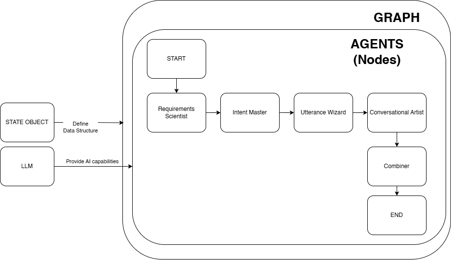

# Introduction to Agentic AI - Matthew Sayer

Welcome to my intro to Agentic AI workshop repo.

This workshop, packaged in a single Jupyter notebook, aims to introduce participants to Agentic Systems and demonstrate their application in solving real-world problems in conversational AI design.

In this guide, you will use Jupyter notebook to create a Conversation Design Agent using LangGraph, serving as an introduction to Agentic System design principles.

## Conversation Design Agent Architecture

    

The agent workflow consists of these key nodes:
- Requirements Scientist - Analyzes business requirements and extracts key needs
- Intent Master - Identifies and categorizes core user intents
- Utterance Wizard - Generates diverse training phrases for each intent
- Conversational Artist - Crafts engaging, contextually appropriate responses
- Combiner - Collects all outputs and creates a readable final document

## Prerequisites

**_Required:_**

- Python 3.11.9+ with uv
- ollama

## Getting Started

1. Create and activate a virtual environment with uv (as shown in the notebook)
2. Run the Jupyter notebook to build and execute the agent

## Author

### [Matthew Sayer]
- **Email:** matthew.sayer1@gmail.com
